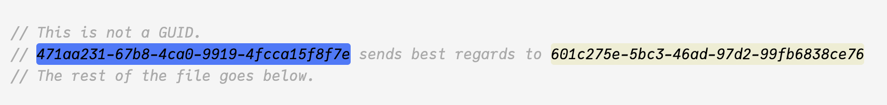

# guid-highlight VS Code extension

Highlights GUIDs in your code/text files.



Visual Studio Code Marketplace: [guid-highlight](https://marketplace.visualstudio.com/items?itemName=thecentury.guid-highlight).

Uses significant portions of code from the [vscode-ext-color-highlight](https://github.com/enyancc/vscode-ext-color-highlight) extension.

## Features

Highlights [GUIDs](https://en.wikipedia.org/wiki/Universally_unique_identifier) in format `xxxxxxxx-xxxx-xxxx-xxxx-xxxxxxxxxxxx`.

## Release Notes

### 1.0.0

Initial release.

## How to build and publish

To build and test the extension, hit `F5` in Visual Studio Code.

1. Install `vsce` tool if you haven't already:
```shell
npm install -g @vscode/vsce
```

1. Build the extension:
```shell
vsce package
```

1. Publish it to the marketplace:
```shell
vsce publish
```